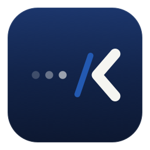
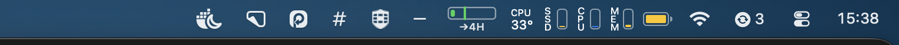

<p align="center">
  
</p>

<h1 align="center">MenubarHide</h1>

<p align="center">
  Hide menu bar icons on macOS — and see them in a panel <em>below</em> the menu bar,<br>
  so the notch never swallows them again.
</p>

<p align="center">
  
  
  
</p>

---

<p align="center">
  
  <br><sub>Panel mode: the hidden icons live in a floating panel below the menu bar — out of the notch's reach</sub>
</p>

## Why

Menu bar managers usually reveal hidden icons *sideways*. On a MacBook with a notch and a crowded menu bar, that doesn't work: macOS simply refuses to draw the icons that don't fit next to the notch — they stay invisible.

MenubarHide offers both modes:

- **Sideways** (classic): a separator expands to push icons off-screen, one click brings them back.
- **Panel** (notch-friendly): hidden icons appear in a floating panel **below** the menu bar. Every icon is always visible and clickable, no matter how full the bar is.

<p align="center">
  
  <br><sub>Sideways mode expanded: the icons you chose to hide sit left of the <code>#</code>; the <code>−</code> collapses them again</sub>
</p>

Tested and battle-hardened on **macOS 26 Tahoe**, which broke several assumptions older menu bar managers rely on (see [How it works](#how-it-works)).

## Install

Download `MenubarHide.dmg` from the [latest release](../../releases/latest), drag the app to Applications and open it. The app is signed with a Developer ID and notarized by Apple — no Gatekeeper warnings.

Requires macOS 14 (Sonoma) or later. Universal binary: Apple Silicon and Intel.

## Usage

| Action | How |
|---|---|
| Choose which icons to hide | Hold **⌘** and drag them to the **left** of the `#` separator |
| Hide / show | Click the **+** / **−** button, or press **⌃⌥H** anywhere |
| Panel mode (icons below the bar) | Right-click the button → **Show Hidden Icons in Panel** |
| Click a hidden icon in the panel | Just click it — the click is forwarded to the real icon |
| Rearrange icons while in panel mode | **⌥-click** the button to expand sideways, then ⌘-drag |
| Start at login | Right-click the button → **Launch at Login** |

After a system reboot the app starts **expanded** for the first minutes, so menu bar apps that launch late don't get hidden by accident. Collapse it with one click once your bar has settled.

### Permissions

| Permission | Needed for | When |
|---|---|---|
| **Screen Recording** | Drawing the hidden icons inside the panel (they belong to other apps, so the only way to show them is to capture their tiny windows) | First time the panel opens. macOS requires relaunching the app after granting |
| **Accessibility** | Forwarding your click from the panel to the real icon | First time you click an icon in the panel |

Nothing is recorded or stored: captures are point-in-time images of the icon windows only, kept in memory while the panel is open. The sideways mode needs no permissions at all.

## How it works

- **Hiding** uses the classic [Hidden Bar](https://github.com/dwarvesf/hidden) technique: an `NSStatusItem` separator whose length expands to 10,000 pt, pushing everything left of it off-screen.
- **The panel** uses the technique pioneered by [Ice](https://github.com/jordanbaird/Ice): find the hidden item windows via `CGWindowList`, capture them with ScreenCaptureKit, render the images in an `NSPanel`, and forward clicks with synthetic `CGEvent`s.
- **macOS 26 Tahoe quirks** this app handles (they cost us the whole v1 debugging session):
  - A full menu bar parks *new* status items off-screen (x ≈ −4220), so they never appear. Preferred positions are pinned via `UserDefaults` on every launch.
  - Collapsing too early scrambles the saved item positions (even swapping their order); the initial collapse is delayed until the layout settles.
  - Status item windows are owned by **Control Center**, not by the app that created them — the scanner identifies the separator by shape (the 10,000 pt window arrives clamped to ~5,016 pt).
  - No API can capture an off-screen window (ScreenCaptureKit fails with `-3811`), so the panel does a 300 ms *flash-expand*: show the icons, capture, hide again.

## Building from source

Requires Xcode 16+ and [XcodeGen](https://github.com/yonaskolb/XcodeGen) (`brew install xcodegen`).

```bash
git clone https://github.com/junior-rj/menubar-hide.git
cd menubar-hide
xcodegen
xcodebuild -project MenubarHide.xcodeproj -scheme MenubarHide -configuration Debug build
```

`project.yml` is the source of truth; the `.xcodeproj` is generated and gitignored. `scripts/release.sh` produces the signed and notarized DMG (adjust the signing identity and notary profile to your own team).

> Tip: features that need permissions (the panel) must be tested on the build installed in `/Applications` — macOS invalidates TCC grants when the code signature changes between Debug and Release builds.

## Credits

Technique references: [Hidden Bar](https://github.com/dwarvesf/hidden) (MIT) for the expanding-separator trick and [Ice](https://github.com/jordanbaird/Ice) (GPL-3.0) for the below-the-bar panel concept. Both were used as *study references only* — all code in this repository is original.

## License

[MIT](LICENSE) © Sparrow Serviços e Soluções em Informática

---

## Português (resumo)

**MenubarHide** esconde ícones da menu bar do macOS e mostra os escondidos num **painel abaixo da menu bar** — resolvendo o problema do notch, que engole os ícones quando a barra lota.

- **Instalar**: baixe o `MenubarHide.dmg` na [última release](../../releases/latest), arraste pra Aplicativos e abra (assinado e notarizado pela Apple).
- **Usar**: segure **⌘** e arraste pra **esquerda** do `#` os ícones que quer esconder; clique no **+**/**−** ou use **⌃⌥H** pra alternar; clique-direito no botão pra ativar o **modo painel** e o **iniciar com o sistema**; **⌥-clique** expande lateral pra reorganizar os ícones.
- **Permissões**: o painel pede **Gravação de Tela** (capturar a imagem dos ícones, que pertencem a outros apps — exige relançar o app após conceder) e **Acessibilidade** (encaminhar o clique pro ícone real). Nada é gravado ou armazenado; o modo lateral não pede permissão nenhuma.
- Requer macOS 14+ (binário universal: Apple Silicon e Intel). Código original, MIT; técnicas estudadas no Hidden Bar e no Ice.
