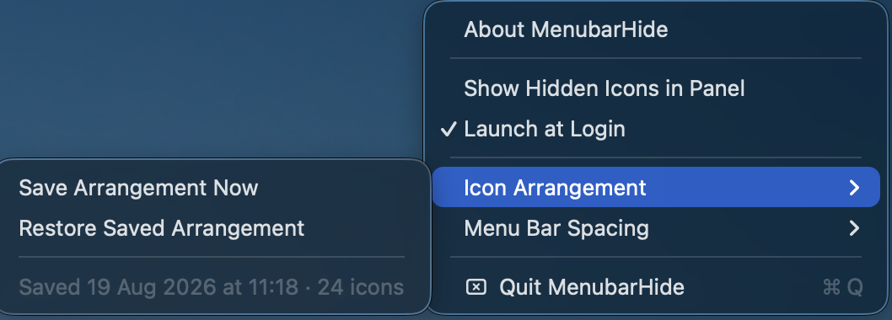
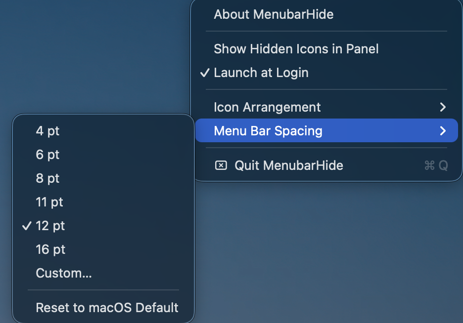

<p align="center">
  
</p>

<h1 align="center">MenubarHide</h1>

<p align="center">
  Hide menu bar icons on macOS — and see them in a panel <em>below</em> the menu bar,<br>
  so the notch never swallows them again.
</p>

<p align="center">
  
  
  
</p>

<p align="center">
  <a href="https://www.sparrow.tec.br/menubar-hide/">Website</a> ·
  <a href="../../releases/latest">Download</a>
</p>

---

<p align="center">
  
  <br><sub>Panel mode (macOS 26 and earlier): the hidden icons live in a floating panel below the menu bar — out of the notch's reach</sub>
</p>

## Why

Menu bar managers usually reveal hidden icons *sideways*. On a MacBook with a notch and a crowded menu bar, that doesn't work: macOS simply refuses to draw the icons that don't fit next to the notch — they stay invisible.

MenubarHide offers both modes:

- **Sideways** (classic): a separator expands to push icons off-screen, one click brings them back.
- **Panel** (notch-friendly): hidden icons appear in a floating panel **below** the menu bar. Every icon is always visible and clickable, no matter how full the bar is.

<p align="center">
  
  <br><sub>Sideways mode expanded: the icons you chose to hide sit left of the <code>#</code>; the <code>−</code> collapses them again</sub>
</p>

Tested and battle-hardened on **macOS 26 Tahoe** and **macOS 27**, each of which rewrote parts of the menu bar that older managers depend on (see [How it works](#how-it-works)).

## Install

Download `MenubarHide.dmg` from the [latest release](../../releases/latest), drag the app to Applications and open it. The app is signed with a Developer ID and notarized by Apple — no Gatekeeper warnings.

Requires macOS 14 (Sonoma) or later. Universal binary: Apple Silicon and Intel.

## Usage

| Action | How |
|---|---|
| Choose which icons to hide | Hold **⌘** and drag them to the **left** of the `#` separator |
| Hide / show | Click the **+** / **−** button, or press **⌃⌥H** anywhere |
| Panel mode (icons below the bar) *(macOS 26 and earlier)* | Right-click the button → **Show Hidden Icons in Panel** |
| Click a hidden icon in the panel | Just click it — the click is forwarded to the real icon |
| Rearrange icons while in panel mode *(macOS 26 and earlier)* | **⌥-click** the button to expand sideways, then ⌘-drag |
| Start at login | Right-click the button → **Launch at Login** |
| Fit more icons on the bar | Right-click the button → **Menu Bar Spacing** → pick a smaller value |
| Save / restore the icon layout *(macOS 26 and earlier)* | Right-click the button → **Icon Arrangement** |

After a system reboot the app starts **expanded** and collapses on its own once the menu bar stops changing: a few seconds on a quiet bar, up to two minutes after a busy login. That way menu bar apps that launch late don't get hidden by accident.

If ⌃⌥H is already taken by another app, the right-click menu says so; the button still works.

### Your arrangement survives a restart

macOS gives every app its own memory of where its icon sits, and a crowded menu bar corrupts that memory: an app that launches while the bar is full gets parked off-screen and *remembers* the bad position, so its icon keeps coming back on the wrong side of the separator (or not at all).

MenubarHide remembers the whole layout while the bar is expanded and stable, and writes it back on every launch. Two things worth knowing:

- Icons only move when the app that owns them **launches again**, so a repair applied now shows up after that app restarts, or after your next login.
- Snapshots are only taken while the icons are visible. If you want to pin a layout on the spot, expand the bar and use **Icon Arrangement → Save Arrangement Now**.

<p align="center">
  
  <br><sub>The submenu tells you when the layout was last remembered, and how many icons it covers</sub>
</p>

### Menu bar spacing

**Menu Bar Spacing** sets the macOS-wide `NSStatusItemSpacing` and `NSStatusItemSelectionPadding` defaults (the same values you would write with `defaults write -g`). Smaller values pack the icons tighter, which is the only real way to fit more of them on a laptop bar. Every app reads the setting when it launches, so the change appears **after you log out and back in**, or restart. **Reset to macOS Default** removes both keys.

<p align="center">
  
  <br><sub>Presets, a custom value, or back to the macOS default. The check marks whatever is set right now</sub>
</p>

### macOS 27

macOS 27 rebuilt the menu bar as a single window and gave it its own overflow button (the `«`). Hiding still works: when you collapse, the icons you put left of the `#` move into that native overflow menu, where they stay visible and clickable. What changes:

- **After you update, drag your icons to the left of the `#` once.** The app re-registers its items under new names, and macOS places them at the left end of the bar, so on the first launch nothing is hidden until you arrange them.
- **Panel mode and Icon Arrangement are disabled** on macOS 27. The system no longer exposes the per-icon windows the panel captured, or the per-app position keys the arrangement saved. Both stay available on macOS 26 and earlier.
- **Wide and multi-display setups** are covered by inflating the separator together with a few zero-width spacers, up to about 3.5× the width of your narrowest display.

### Permissions

| Permission | Needed for | When |
|---|---|---|
| **Screen Recording** | Drawing the hidden icons inside the panel (they belong to other apps, so the only way to show them is to capture their tiny windows) | First time the panel opens. macOS requires relaunching the app after granting |
| **Accessibility** | Forwarding your click from the panel to the real icon | First time you click an icon in the panel |

Nothing is recorded or stored: captures are point-in-time images of the icon windows only, kept in memory while the panel is open. The sideways mode needs no permissions at all.

## How it works

- **Hiding** uses the classic [Hidden Bar](https://github.com/dwarvesf/hidden) technique: an `NSStatusItem` separator whose length expands to push everything left of it off-screen (10,000 pt on macOS 26 and earlier).
- **The panel** uses the technique pioneered by [Ice](https://github.com/jordanbaird/Ice): find the hidden item windows via `CGWindowList`, capture them with ScreenCaptureKit, render the images in an `NSPanel`, and forward clicks with synthetic `CGEvent`s.
- **macOS 26 Tahoe quirks** this app handles (they cost us the whole v1 debugging session):
  - A full menu bar parks *new* status items off-screen (x ≈ −4220), so they never appear. Preferred positions are pinned via `UserDefaults` on every launch.
  - Collapsing too early scrambles the saved item positions (even swapping their order); the initial collapse is delayed until the layout settles.
  - Status item windows are owned by **Control Center**, not by the app that created them — the scanner identifies the separator by shape (the 10,000 pt window arrives clamped to ~5,016 pt).
  - No API can capture an off-screen window (ScreenCaptureKit fails with `-3811`), so the panel does a 300 ms *flash-expand*: show the icons, capture, hide again.
- **macOS 27** rewrote the menu bar into one window owned by `MenuBarAgent`, so there are no per-icon windows and no per-app position keys any more. It also **discards** a status item once its length reaches half the display width, instead of clamping it. So the separator is sized just under that cliff (`max(200, floor(narrowest ÷ 2 − 64))` pt, tracking the notch's trailing area on notched displays), and up to six zero-width spacers inflate with it to cover the widest display; what they displace lands in the system's own `«` overflow menu. The items register under fresh autosave names because a new name always lands leftmost and their positions can no longer be seeded.
- **Remembering the layout** reads every app's `NSStatusItem Preferred Position` key straight from its preferences domain via `CFPreferences`, and writes the remembered values back at launch. Sandboxed apps keep that key inside their container, so those are addressed by the container plist path instead of the bundle id. Positions are keyed by (domain, key), which sidesteps the identification problem above: it never needs to know which window belongs to which app.

## Building from source

Requires Xcode 16+ and [XcodeGen](https://github.com/yonaskolb/XcodeGen) (`brew install xcodegen`).

```bash
git clone https://github.com/junior-rj/menubar-hide.git
cd menubar-hide
xcodegen
xcodebuild -project MenubarHide.xcodeproj -scheme MenubarHide -configuration Debug build
```

`project.yml` is the source of truth; the `.xcodeproj` is generated and gitignored. Signed releases (signing, notarization, DMG) are produced by the author's own tooling; to release your own build, sign and notarize with your team's Developer ID.

> Tip: features that need permissions (the panel) must be tested on the build installed in `/Applications` — macOS invalidates TCC grants when the code signature changes between Debug and Release builds.

## Credits

Technique references: [Hidden Bar](https://github.com/dwarvesf/hidden) (MIT) for the expanding-separator trick and [Ice](https://github.com/jordanbaird/Ice) (GPL-3.0) for the below-the-bar panel concept. Both were used as *study references only* — all code in this repository is original.

## License

[MIT](LICENSE) © Sparrow Serviços e Soluções em Informática

---

## Português (resumo)

**MenubarHide** esconde ícones da menu bar do macOS e mostra os escondidos num **painel abaixo da menu bar** — resolvendo o problema do notch, que engole os ícones quando a barra lota.

- **Instalar**: baixe o `MenubarHide.dmg` na [última release](../../releases/latest), arraste pra Aplicativos e abra (assinado e notarizado pela Apple).
- **Usar**: segure **⌘** e arraste pra **esquerda** do `#` os ícones que quer esconder; clique no **+**/**−** ou use **⌃⌥H** pra alternar; clique-direito no botão pra ativar o **modo painel** e o **iniciar com o sistema**; **⌥-clique** expande lateral pra reorganizar os ícones.
- **Arranjo dos ícones**: o app memoriza a posição de todos os ícones enquanto a barra está expandida e reescreve no launch, então o layout sobrevive a reinício (cada ícone volta ao lugar na próxima vez que o app dono dele abrir). Clique-direito → **Icon Arrangement** pra salvar ou restaurar na hora.
- **Espaçamento**: clique-direito → **Menu Bar Spacing** ajusta o espaço entre os ícones (equivale ao `defaults write -g NSStatusItemSpacing`); vale após logoff ou reinício.
- **Permissões**: o painel pede **Gravação de Tela** (capturar a imagem dos ícones, que pertencem a outros apps — exige relançar o app após conceder) e **Acessibilidade** (encaminhar o clique pro ícone real). Nada é gravado ou armazenado; o modo lateral não pede permissão nenhuma.
- **macOS 27**: a barra virou uma janela só, com botão de overflow nativo (`«`). O hide continua funcionando (os ícones à esquerda do `#` vão pro `«`), mas após atualizar arraste-os pra esquerda do `#` uma vez; o modo painel e o Icon Arrangement ficam desabilitados no 27 (iguais no 26 e anteriores).
- Requer macOS 14+ (binário universal: Apple Silicon e Intel). Código original, MIT; técnicas estudadas no Hidden Bar e no Ice.
