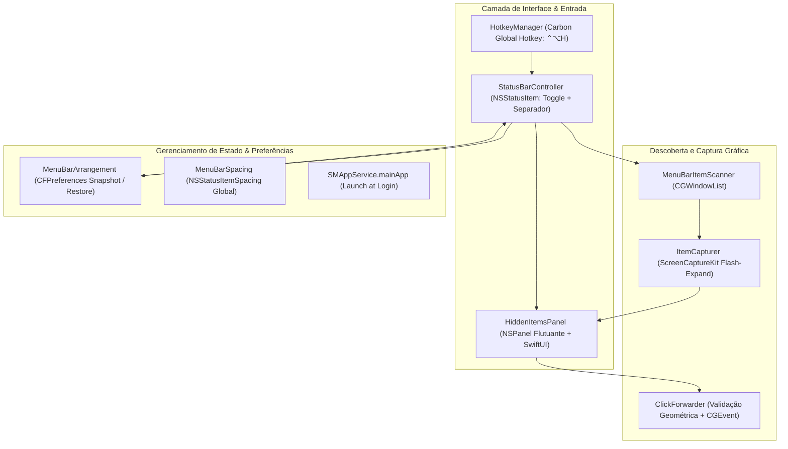

# Relatório de Auditoria Técnica e de Segurança — menubar-hide

**Data da Auditoria:** 24 de agosto de 2026
**Versão do Projeto:** 1.4.0 (Build 5)
**Stack Tecnológica:** Swift 6.0, SwiftUI, AppKit, ScreenCaptureKit, Carbon Hotkeys, CoreGraphics / CGEvent, XcodeGen
**Ambiente de Execução:** macOS 14.0+ (Sonoma / Sequoia / Tahoe)

---

## 1. Sumário Executivo

O **menubar-hide** é um utilitário nativo de sistema para macOS voltado para a organização, ocultação e expansão de ícones da barra de menus (`NSStatusItem`), oferecendo solução tanto para telas convencionais quanto para MacBooks com entalhe de câmera (_notch_).

O aplicativo disponibiliza dois modos de operação: recolhimento lateral clássico (empurrando ícones para fora da tela através de um separador de comprimento expandido) e visualização em painel flutuante suspenso logo abaixo da barra de menus. O sistema implementa restauração automática de posições de ícones via `CFPreferences`, injeção segura de cliques sintéticos via `CGEvent` e atalhos globais de teclado via Carbon.

---

## 2. Arquitetura e Engenharia de Software

O aplicativo opera como processo exclusivo de barra de menus (`LSUIElement: true`), gerenciando diretamente janelas de status de baixo nível do AppKit e CoreGraphics.

### Destaques Técnicos:

1. **Prevenção de Corrupção no Boot:** Algoritmo de polling de estabilização pós-login (mínimo de 500ms e 3 leituras idênticas de fingerprint de janelas) antes do primeiro recolhimento, prevenindo o embaralhamento de posições de aplicativos que inicializam lentamente.
2. **Preservação de Posições via CFPreferences:** Leitura e gravação direta no domínio dos aplicativos proprietários (`NSStatusItem Preferred Position <autosaveName>`), permitindo restaurar ícones desalojados pelo sistema operacional.
3. **Anti-Spoofing em Cliques Sintéticos:** O `ClickForwarder` valida rigorosamente se as coordenadas do clique residem dentro dos limites reais da barra de menus de um display ativo antes de disparar o `CGEvent`, mitigando riscos de hijacking de cliques na área de trabalho.
4. **Flash-Expand de Captura Não Destrutivo:** Mecanismo temporário de 300ms para permitir que o `ScreenCaptureKit` obtenha o bitmap de janelas sem disparar a sobrescrita do snapshot de posições do macOS.

---

## 3. Auditoria de Segurança e Conformidade

| Vetor de Segurança                    |   Avaliação    | Análise Técnica                                                                                                                               |
| ------------------------------------- | :------------: | --------------------------------------------------------------------------------------------------------------------------------------------- |
| **Gestão de Segredos**                |   **Forte**    | Ausência total de API keys, credenciais ou tokens. O software opera 100% offline.                                                             |
| **Permissões de Sistema (TCC)**       |  **Conforme**  | Exige permissões de Gravação de Tela (ScreenCaptureKit) e Acessibilidade (CGEvent). Tratamento gracioso quando permissões são negadas.        |
| **Hardened Runtime e Notarização**    |  **Conforme**  | `ENABLE_HARDENED_RUNTIME: YES` ativo no `project.yml`. Distribuição com assinatura Developer ID e notarização válida via `notarytool`.        |
| **App Sandbox**                       | **Desativado** | Desativação necessária e justificada: o aplicativo requer controle sobre janelas de outros processos e leitura de `CFPreferences` do sistema. |
| **Integridade de Eventos Sintéticos** |   **Forte**    | Cliques simulados por acessibilidade validam a geometria da tela e exigem `mouseEventClickState=1`.                                           |

---

## 4. Qualidade de Código, Concorrência e Padrões da Plataforma

- **Suíte de Testes Automatizados:** Testes com Swift Testing / XCTest no target `MenubarHideTests`. O `AppDelegate` desativa inicialização real sob ambiente de testes para não alterar a barra de menus do desenvolvedor.
- **Internacionalização Completa:** String Catalog em `Localizable.xcstrings` cobrindo 100% dos textos em Inglês e Português do Brasil, incluindo suporte a variações plurais em `stringsdict`.
- **Autostart Moderno:** Integração nativa com `SMAppService.mainApp`, dispensando scripts legados em launchd ou pacotes auxiliares obsoletos.

---

## 5. Matriz de Inconsistências e Vulnerabilidades Encontradas

| #   | Componente / Arquivo                   | Tipo / Severidade          | Descrição do Problema                                                                                                                                      | Impacto Potencial                                                                                                                              | Mitigação Recomendada                                                                                                    |
| --- | -------------------------------------- | -------------------------- | ---------------------------------------------------------------------------------------------------------------------------------------------------------- | ---------------------------------------------------------------------------------------------------------------------------------------------- | ------------------------------------------------------------------------------------------------------------------------ |
| 1   | `MenubarHide/MenuBarArrangement.swift` | Baixa (Depreciação de API) | Varredura de preferências lê arquivos em `~/Library/Preferences/*.plist` devido à indisponibilidade de `CFPreferencesCopyApplicationList` no SDK macOS 26. | Caso o macOS imponha novas restrições de leitura na pasta de preferências em versões futuras, a descoberta de novos domínios pode ser afetada. | Manter fallback indexado pelas chaves de status items conhecidos descobertos via `CGWindowListCopyWindowInfo`.           |
| 2   | `MenubarHide/HiddenItemsPanel.swift`   | Baixa (Desempenho Visual)  | A captura de ícones via flash-expand de 300ms pode gerar leve oscilação perceptível em displays de alta taxa de atualização (120Hz ProMotion).             | Micro-flicker visual temporário no momento em que o painel flutuante é invocado pela primeira vez.                                             | Utilizar buffer em cache de bitmaps com invalidação acionada exclusivamente por eventos de mudança de janela do sistema. |

---

## 6. Plano de Ação Priorizado e Recomendações

1. **Otimização de Cache de Bitmaps:** Implementar cache em memória das miniaturas dos ícones capturados para reduzir a frequência de flash-expands.
2. **Auditoria de Compatibilidade SDK:** Acompanhar eventuais mudanças de permissões de leitura de plists no macOS Tahoe.

---

## 7. Veredito da Auditoria

- **Classificação Geral:** **Aprovado com Louvor (Excelente)**
- **Postura de Segurança:** Alta (Hardened Runtime, anti-spoofing em eventos e transparência de permissões TCC).
- **Conformidade Técnica:** Engenharia de baixo nível refinada, resiliente a particularidades do macOS.
