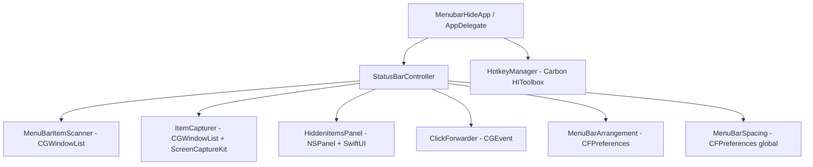

# Relatório de Auditoria e Análise Técnica: MenubarHide

> Revisão de 2026-08-22. Cada afirmação desta versão foi conferida contra o código
> em `MenubarHide/`, `project.yml` e `scripts/release.sh`. A versão anterior deste
> documento continha seis erros factuais e superavaliava a garantia de segurança da
> seção 5.3; as correções estão marcadas ao longo do texto.

## 1. Visão Geral Executiva

O **MenubarHide** é um utilitário nativo para macOS escrito em **Swift 6** com
concorrência estrita (`SWIFT_STRICT_CONCURRENCY: complete`), deployment target
**macOS 14.0**, testado até o macOS 26 Tahoe. São 1113 linhas de Swift no app, sem
nenhuma dependência externa.

O objetivo é gerenciar e ocultar ícones da barra de menus, resolvendo o entalhe
(_notch_) dos MacBooks e a degradação de layout de uma barra lotada.

### Modos de Operação

- **Modo Lateral (técnica do Hidden Bar):** um `NSStatusItem` separador tem o
  `length` expandido para 10.000 pt, empurrando para fora da tela todos os ícones à
  sua esquerda.
- **Modo Painel (técnica do Ice Bar):** as janelas dos itens ocultos são localizadas
  via `CGWindowListCopyWindowInfo`, capturadas como imagem e exibidas num `NSPanel`
  flutuante abaixo da barra, com o clique encaminhado por `CGEvent`.

---

## 2. Arquitetura do Sistema e Diagrama de Componentes

### Fluxo de Execução

1. **Inicialização:** o `AppDelegate` instancia `StatusBarController` e, em seguida,
   `HotkeyManager`. Sob XCTest a inicialização é pulada de propósito, para que rodar
   os testes não crie status items na barra real do usuário.
2. **Restauração de Arranjo:** ainda no `init` do controller, antes de criar os
   próprios itens, `MenuBarArrangement.restore` grava as posições preferidas nos
   domínios de cada app. Isso só tem efeito no próximo launch de cada app dono, já
   que o AppKit lê a posição na criação do status item.
3. **Fixação dos Itens Próprios:** as posições de `menubarhide_toggle` e
   `menubarhide_separator` são validadas por `isSanePair` e regravadas antes da
   chamada a `NSStatusBar.system.statusItem`.
4. **Estabilização Inicial:** espera mínima de 500 ms, depois polling do fingerprint
   das janelas de status a cada 2 s até 3 leituras iguais consecutivas, com teto de
   ~120 s. Só então ocorre o primeiro recolhimento.

---

## 3. Análise Detalhada dos Componentes

### 3.1 StatusBarController (`MenubarHide/StatusBarController.swift`)

- **Responsabilidade:** orquestrador de estado (`isCollapsed`), menus de contexto,
  tarefas assíncronas e apresentação.
- **Técnica de Ocultação:** manipulação direta de `separatorItem.length`. A
  propriedade `isVisible` não é usada em nenhum `NSStatusItem`, o que preserva as
  chaves de posição autossalvas pelo AppKit.
- **Auto-Recolhimento:** `NSEvent.addGlobalMonitorForEvents` captura o clique
  seguinte que dispensa o menu aberto, com temporizador de contingência de 15 s e um
  atraso prévio de 400 ms para ignorar o próprio clique sintético.
- **Isolamento de Concorrência:** classe `@MainActor`.

### 3.2 MenuBarItemScanner (`MenubarHide/MenuBarItemScanner.swift`)

- **Responsabilidade:** descoberta de janelas na camada de status
  (`kCGWindowLayer == statusWindow`) e cálculo de coordenadas.
- **Mudança do macOS 26:** as janelas de status reportam o _Control Center_ como
  dona, o que inutiliza filtragem por PID ou nome. O separador é identificado pela
  geometria: `separatorMinWidth = 2500` pt, folga confortável abaixo do valor real
  observado (o `length` de 10.000 chega clampado em ~5016).
- **Varredura Contígua:** percorre à esquerda a partir da borda do separador,
  interrompendo em vãos maiores que 50 pt.

### 3.3 ItemCapturer (`MenubarHide/ItemCapturer.swift`)

> **Correção.** A versão anterior deste relatório dizia que o ScreenCaptureKit era
> usado "quando a janela está fora do viewport". É o contrário: para janelas fora da
> tela **as duas** APIs falham (SCK devolve -3811, a legada devolve nil), e é
> exatamente para isso que existe o flash-expand.

- **Ordem real:** tenta primeiro `CGWindowListCreateImage`, mais barata para
  superfícies pequenas, e só recorre a `SCScreenshotManager.captureImage` quando a
  legada devolve nil.
- **Busca preguiçosa do `SCShareableContent`:** o inventário do ScreenCaptureKit só
  é buscado quando o caminho legado falha para pelo menos uma janela, e a falha dele
  não impede mais as capturas legadas. Antes ele era buscado antes do laço e um erro
  abortava a função inteira, deixando o caminho dito prioritário atrás de um portão.
- **Escala por tela:** o `backingScaleFactor` é o da tela onde a janela está, casada
  pela coordenada X (idêntica entre o espaço do CGWindowList e o do NSScreen, ao
  contrário do Y). Em setup misto Retina/externa isso preserva a nitidez.
- **Permissões TCC:** encapsula `CGPreflightScreenCaptureAccess` e
  `CGRequestScreenCaptureAccess`. Vale notar que as duas APIs de captura exigem
  Gravação de Tela, então na prática elas falham juntas quando a permissão falta.

### 3.4 HiddenItemsPanel (`MenubarHide/HiddenItemsPanel.swift`)

- **Subclasses obrigatórias:**
  - `ClickablePanel` (`NSPanel`): sobrescreve `canBecomeKey` para `true`, sem o que
    uma janela `.borderless` recusa foco e mata botões e a tecla Esc. Combinado com
    `.nonactivatingPanel`, que evita ativar o app (`LSUIElement`).
  - `FirstMouseHostingView` (`NSHostingView`): sobrescreve `acceptsFirstMouse` para
    `true`, senão o primeiro clique apenas foca a janela.
- **Dispensa:** monitor global de clique fora e monitor local de Esc (keyCode 53),
  ambos com captura fraca de `self` e removidos em `close()`.
- **UI:** SwiftUI com `.regularMaterial` e cantos arredondados.

### 3.5 ClickForwarder (`MenubarHide/ClickForwarder.swift`)

- **Sequência:** `mouseMoved` no alvo (inicializa o estado de hover de status items
  de terceiros), depois `leftMouseDown` e `leftMouseUp`, ambos com
  `mouseEventClickState = 1`, sem o que a maioria dos status items descarta o
  evento. Restauração opcional da posição original do cursor.
- **Validação geométrica:** ver seção 5.3, que descreve o que ela garante e o que
  não garante.

### 3.6 MenuBarArrangement (`MenubarHide/MenuBarArrangement.swift`)

- **Modelo de dados:** cada app guarda sua posição sob a chave
  `NSStatusItem Preferred Position <autosaveName>` no próprio domínio de
  preferências. A indexação é por (domínio, chave), o que contorna a ambiguidade dos
  `Item-0` dos apps que não nomeiam o autosave.
- **Descoberta de domínios:** `CFPreferencesCopyApplicationList` está marcada
  unavailable no SDK 26, então os domínios são enumerados listando
  `~/Library/Preferences/*.plist`. A leitura e a escrita passam por
  `CFPreferencesCopyKeyList`, `CFPreferencesCopyValue` e `CFPreferencesSetValue`,
  que mantêm o `cfprefsd` coerente, ao contrário de editar o plist na mão.

> **Correção.** A versão anterior dizia que o descarte era de "valores negativos". O
> critério real é a faixa fechada `0...10_000` (`validRange`). O valor negativo do
> parking off-screen (x ≈ -4220) é apenas o caso motivador; `0` é uma posição
> legítima (mais à direita) e valores acima de 10.000 também são descartados.

- **Fusão conservadora:** valores fora da faixa são descartados na captura, então
  substituir o snapshot esqueceria o último valor bom justamente quando ele importa.
  Daí o merge chave a chave. Domínios cujo plist sumiu (app desinstalado) saem do
  snapshot.
- **Custo:** 73 ms na primeira chamada, 2 ms depois (o `cfprefsd` cacheia). Roda
  inline na main de propósito: o collapse logo em seguida estragaria o que ela leria.

### 3.7 MenuBarSpacing (`MenubarHide/MenuBarSpacing.swift`)

- Escreve `NSStatusItemSpacing` e `NSStatusItemSelectionPadding` no domínio global
  `kCFPreferencesAnyApplication`, equivalente a `defaults write -g`. A leitura passa
  por `CFPreferences` e não por `UserDefaults.standard`, que enxergaria também um
  valor do próprio app.

> **Correção.** A versão anterior falava em "predefinições de 4 pt a 16 pt", o que
> sugere faixa contínua. São seis valores discretos: `[4, 6, 8, 11, 12, 16]`. A
> faixa `0...32` é a do valor customizado.

- Só tem efeito após logout ou reinício, já que cada app lê a chave no próprio
  launch.

### 3.8 HotkeyManager (`MenubarHide/HotkeyManager.swift`)

- Registra `⌃⌥H` via Carbon HIToolbox (`RegisterEventHotKey` e
  `InstallEventHandler`), sem dependências externas. `⌘⌥H` é do sistema.
- O callback C despacha com `MainActor.assumeIsolated`, seguro porque o Carbon
  entrega no run loop principal.
- `Unmanaged.passUnretained` para o ponteiro de contexto, agora balanceado por um
  `deinit` que chama `UnregisterEventHotKey` e `RemoveEventHandler`.

---

## 4. Auditoria de Concorrência, Memória e Boas Práticas Swift 6

| Critério | Avaliação | Detalhes |
| --- | --- | --- |
| **Concorrência Estrita** | Conforme | `SWIFT_STRICT_CONCURRENCY: complete` e `SWIFT_VERSION: "6.0"`. Build limpo, sem aviso de concorrência. |
| **Gerenciamento de Ciclo de Vida** | Conforme | Todas as closures assíncronas e monitores capturam `self` de forma fraca. **Isso não era verdade quando a versão anterior deste relatório afirmou que era:** três closures capturavam forte, incluindo a do monitor de auto-recolhimento, que fechava um ciclo `self` → monitor → closure → `self` enquanto armado. Corrigido. |
| **Desarme de Monitores** | Conforme | `NSEvent.removeMonitor` em `disarmAutoCollapse()` (alcançado por `stateWillChange()`), em `finishAutoCollapse()` e no `close()` do painel. |
| **Tratamento de Ponteiros e C ABI** | Conforme | `Unmanaged.passUnretained` no `HotkeyManager`, agora com `deinit` desregistrando hotkey e handler. Antes a registração Carbon era desbalanceada, o que a versão anterior não mencionou ao marcar este critério como conforme. |

**Ressalva honesta sobre desalocação:** nenhuma dessas classes chega a ser
desalocada. O `AppDelegate` retém controller e hotkey manager pela vida do processo.
Os `deinit` e as capturas fracas são rede de segurança para quando a posse mudar, não
conserto de vazamento observável hoje.

**Pegadinha do Swift 6 registrada aqui porque vai se repetir:** um `deinit` comum de
classe `@MainActor` não pode tocar propriedades armazenadas de tipo não-Sendable
(`EventHotKeyRef` é `OpaquePointer`). O compilador recusa com "cannot access property
... from nonisolated deinit". A solução é `isolated deinit` (SE-0371), disponível no
toolchain em uso (Swift 6.3.3).

---

## 5. Auditoria de Segurança e Permissões

### 5.1 Sandbox e Runtime

- **App Sandbox desativado (`ENABLE_APP_SANDBOX: NO`):** tecnicamente necessário. O
  app lê e escreve domínios de preferências de terceiros via `CFPreferences` e posta
  eventos globais via `CGEvent`, nenhum dos dois possível sob sandbox.
- **Hardened Runtime ativado (`ENABLE_HARDENED_RUNTIME: YES`):** exigência da
  notarização para distribuição por Developer ID fora da Mac App Store.

### 5.2 Permissões do Sistema (TCC)

1. **Gravação de Tela:** só para o Modo Painel, para capturar as janelas dos itens
   de outros apps. As imagens vivem em memória durante a exibição do painel; não há
   escrita em disco nem tráfego de rede em nenhum ponto do código.
2. **Acessibilidade:** só para encaminhar o clique sintético no Modo Painel.

Trocar a assinatura do app instalado (dev para Developer ID ou vice-versa) invalida
as duas permissões; é preciso reconceder.

### 5.3 Validação do Alvo do Clique

> **Recalibragem.** A versão anterior afirmava que essa checagem estava "bloqueando
> tentativas de desvio de clique". A garantia é mais estreita que isso.

**O que `isInMenuBarStrip` garante:** o frame alvo é validado **antes** de qualquer
evento ser postado, e o `postClick` usa exatamente o frame validado. O predicado
exige que a janela esteja inteiramente contida na horizontal de algum display ativo
(`CGGetActiveDisplayList`), colada ao topo dele (tolerância de 2 pt) e com altura
máxima de 40 pt. Displays à esquerda do principal têm X negativo legítimo e são
aceitos.

O containment horizontal foi acrescentado nesta revisão. Antes só o ponto central do
frame era testado, de modo que uma janela larguíssima centrada na faixa passava. Não
há teto numérico de largura de propósito: status items com texto (relógios,
medidores) são legitimamente largos, e um limite arbitrário quebraria usuários reais.

**O que ela não garante:**

- É puramente geométrica. Não verifica dono, PID nem camada da janela no momento da
  validação. Qualquer janela que consiga se posicionar na faixa da barra de menus
  satisfaz o predicado.
- Sobra um TOCTOU entre a leitura do frame via `CGWindowListCopyWindowInfo` e o
  `post` do `CGEvent`. O clique é entregue por coordenada, não por window ID, então
  quem ocupar aquele ponto no instante do post recebe o evento. Isso é inerente ao
  `CGEvent` e não é fechável nesta camada.

Em resumo: a checagem limita **onde** o clique pode cair, não **quem** o recebe.

---

## 6. Internacionalização e Catálogo de Strings

- String Catalogs modernos: `Localizable.xcstrings` (32 chaves) e
  `InfoPlist.xcstrings`.
- Idioma fonte `en`, localização integral em `pt-BR`. Cobertura conferida: **zero**
  unidades com estado diferente de `translated`, zero `needsReview`.
- Plural no catálogo (`variations.plural`) em `"Restored %lld icon positions"`, e
  não em ternário no código, o que importa em português por causa da concordância.
- Nenhum literal de UI solto no Swift. O único `Text("No hidden icons")` é
  `LocalizedStringKey` do SwiftUI e a chave está traduzida.
- O `project.yml` exclui `**/*.xcstrings` do path de sources e adiciona cada catálogo
  com `buildPhase: resources`, porque o XcodeGen não infere a fase para `.xcstrings`
  e sem isso o catálogo não vira `.lproj` no bundle.

---

## 7. Pipeline de Construção e Empacotamento

`scripts/release.sh`:

1. `xcodegen` para regenerar o projeto.
2. `xcodebuild archive` e `-exportArchive` com `Developer ID Application`.
3. Isolamento do `.app` num staging temporário via `ditto --noextattr --norsrc`,
   necessário porque a pasta de trabalho é sincronizada e contamina o bundle com
   `com.apple.FinderInfo`, o que faz o `codesign --strict` rejeitar.
4. `codesign --verify --strict --deep` e dump de entitlements para conferência.
5. `hdiutil create -format UDZO`.
6. `codesign` do DMG com a identidade extraída do próprio app.
7. `xcrun notarytool submit --wait` e `xcrun stapler staple`.
8. `spctl -a -t open --context context:primary-signature -vv` como validação final
   de Gatekeeper.

---

## 8. Testes

Havia zero cobertura automatizada até esta revisão. Existe agora um target
`MenubarHideTests` usando **Swift Testing**, com 21 testes em 5 suítes, cobrindo as
funções puras que concentram as regras de decisão:

| Área | O que é verificado |
| --- | --- |
| `MenuBarArrangement.isValid` | fronteiras da faixa, o valor real de parking (-4220), o `0` legítimo |
| `MenuBarArrangement.merge` | leitura fresca vence a salva; domínio desinstalado é descartado; chave corrompida preserva o último valor bom |
| `StatusBarController.isSanePair` | par válido, par invertido (dano de scramble), posições iguais, toggle em `0`, valores parqueados |
| `StatusBarController.isInStrip` | item comum, display com X negativo, janela baixa demais, janela alta demais, janela larga só centrada na faixa, janela larga porém contida, lista de displays vazia |
| `MenuBarSpacing` | todos os presets dentro da faixa permitida, presets ordenados e sem repetição |

Duas notas sobre o desenho:

- O bundle é hospedado pelo app, porque `@testable import` precisa linkar contra o
  target de aplicação. O `applicationDidFinishLaunching` detecta
  `XCTestConfigurationFilePath` e pula a inicialização, sem o que rodar os testes
  criaria status items na barra real e autossalvaria um snapshot do estranho.
- Scanner, capturer, click forwarder e painel ficam de fora de propósito: dependem de
  estado de janela real e de permissões TCC. Testá-los exigiria mocks que testariam o
  mock.

---

## 9. Matriz de Pontos Fortes e Refinamentos

### Pontos Fortes

- Sem dependências externas: nada de CocoaPods, SPM ou frameworks de terceiros.
- Soluções bem documentadas para problemas reais do macOS 26 Tahoe, com o raciocínio
  registrado em comentários no ponto exato do código.
- Aderência a Swift 6 estrito com build limpo.
- Localização completa e sem furos.

### Implementados nesta revisão

1. **Escala por tela na captura** (era a sugestão 1). O `backingScaleFactor` passou a
   ser o da tela da janela. Escopo menor do que a versão anterior sugeria: `scale` só
   afeta o caminho ScreenCaptureKit.
2. **Testes de unidade** (era a sugestão 3). Ver seção 8.

### Em aberto

3. **Domínios de apps sandboxed:** `preferenceDomains()` enumera
   `~/Library/Preferences/*.plist`. Um app em sandbox que guarde a posição apenas em
   `~/Library/Containers/<bundle-id>/Data/Library/Preferences/` ficaria de fora. É
   especulativo até aparecer um caso concreto, e permanece assim.
4. **Cobertura de caminhos de erro:** o comportamento com permissão revogada no meio
   da sessão, e não apenas ausente no início, não foi exercitado.

---

## 10. Conclusão

O código é enxuto, bem comentado e resolve problemas genuinamente difíceis da
plataforma. Depois das correções desta revisão, os quatro critérios da seção 4 se
sustentam sob leitura do código, e não apenas por afirmação.

O que esta auditoria cobriu: leitura integral dos oito arquivos Swift, do
`project.yml`, do `release.sh` e dos catálogos de strings, mais build limpo e suíte
de testes verde.

O que ela não cobriu: comportamento sob permissão revogada durante a sessão, setup
multi-monitor real (a correção de escala foi verificada por leitura, não por
observação), e a interação com a tempestade de launch de login, que continua sendo o
cenário mais frágil do app e o mais caro de reproduzir.
